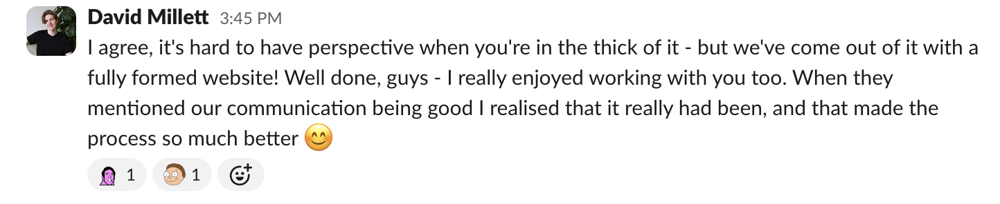

# Local Heroes


### 🔗 Links

**Deployed website:** [Local Heroes](https://localheroesapp.netlify.app/)

This project is comprised of two repositories, one for the front end and one for the back end:

* [Back-end GitHub Repository](https://github.com/david-millett/local-heroes-backend)
* [Front-end GitHub Repository](https://github.com/david-millett/local-heroes-frontend) (the current repo)

### 📅 Timeframe

* 1 week

### 🙌 Working Team

This was a group project, created as a team of three:

- 👨‍💻 David (me!)
- 👩‍💻 [Iris](https://github.com/iris-noonan)
- 👨‍💻 [Adam](https://github.com/AdamGCodes)

We divided tasks and all contributed to the front-end and back-end portions of the project.

## Description

**Local Heroes** is a local community volunteering portal that aims to bring together those who need assistance with day-to-day or specific tasks and those with the skills and time to help with those tasks.

Users must sign up for an account to be able to use the website. They then have the option of posting job requests for tasks that they need help with, or creating a helper profile showcasing their skills and their availability/desire to help. They can also view job requests and helper profiles created by other users.

Jobs/tasks could include things such as shopping, cooking, cleaning, DIY or any other task/job a member of the local community would like help with. The focus of the site is on bringing communities together for the benefit of those who need help but also those who provide help.

In this way, it is hoped that the app could be used to help foster community ties. Users on both sides of the equation will benefit: In addition to helping the people who needed assistance, it will provide fulfilment to users providing help.

## Brief

This was a one-week project as part of a software engineering bootcamp at General Assembly. We were tasked with creating a CRUD application using the MERN stack, applying skills learned in previous weeks of the bootcamp. The deliverables included:
- User stories
- Wireframing
- Planning RESTful routes
- Planning data architecture
- Creating a CRUD site using REACT with an Express backend.

## Technologies Used

### Planning and Documentation:
- Markdown
- Figma
- Trello
- dbdiagram.io

### Developer Tools:
- VSCode

### Front End:
- React.js
- HTML
- SCSS
- JavaScript

### Back End:
- MongoDB
- Express.js
- Node.js
- Mongoose

### Hosting / Cloud Storage:
- Netlify (Deployment)
- Cloudinary (Cloud resource storage)

## Planning

Planning began with a very productive brainstorming session, where we met as a group to suggest and develop ideas. This app was one of three main ideas we considered. *Local Heroes* stood out, as it seemed to lend itself well to being built upon beyond its basic premise, which seemed like a good project to work on as a group.

We divided the planning materials between us: initially, I created the *Figma* wireframe and *Trello* board, Iris created the ERD, and Adam worked on the user stories. We then came together and really drilled down exactly how we wanted the website to work, developing and fine-tuning each of these materials together.

### Design and branding

One of the features we planned during this discussion was to have an achievement/badge system, which would reward users for helping others and interacting with the site. I came up with the idea of a 'Local Hero' badge for someone who has helped a lot in their area, which ultimately inspired us to name the website itself 'Local Heroes'.

We thought this would give the site a fun and friendly feel, just as we intended, and decided to use a superhero concept as our theme. Together, we contributed to a moodboard that I set up in *Figma* to develop this idea.


We also used *Figma* to create wireframes for all of our pages. We designed both a mobile and a desktop version for each page. I was really interested in having a website that dynamically scaled with different screen sizes, and really wanted to develop a site that would show information in different columns when the screen was wider, which could be hidden and rearrange as the screen width was made smaller.

Here is a screenshot showing the wireframes for our landing and dashboard pages:


### Brainstorming

We planned a lot of features for the app. At a basic level, we wanted users to be able to:
* Sign up and log in
* Be able to create, edit, and delete job postings
* Be able to create, edit, and delte helper profiles

We also brainstormed various other features:
* A testimonials/thank you system to thank helpers
* Hero rankings for local areas
* A verification system to improve security and safety of users
* Admin profiles for verification and moderation
* Dynamically change the view based on screen size, have components appear/contract
* Filter system for browsing jobs
* Badge/achievement system
* Pause button for helpers, eg 'I'm away'
* Profiles images
* Image uploads
* A local area feed for the social aspect, giving updates on hero activity
* Map view of nearby jobs
* Ability to delete accounts

### ERD and routing table

Because the website had a lot of ideas, we worked together to drill down our ERD nad routing tables to ensure that they worked how we wanted them to.


### User stories

Finally, we fine-tuned the phases of the project. Since we had brainstormed a lot of ideas, so we needed to prioritise which ones we would work on and in what order. We listened to each other on what we thought were important features and split the project into MVP, stretch 1, and stretch 2 phases. We organised these into individual tasks on our *Trello* board to track progress.


## Build/Code Process

After confirming the project and planning all the necessary materials, we started by working on the back end first.

Adam created the repos in GitHub, and then Iris and I cloned it. Throughout development, we worked on our own individual branches to develop each part, never directly in the main branch.

### The back end

It just so happened that our app divided nicely into three sections. We required a set of three models and controller files, one each for users, helper profiles, and jobs. We therefore divided these among ourselves to ensure we all contributed to all aspects of the project.

Working on my own individual branch `/david/helpers-backend`, I created my parts of the back end, which included the initial helpers model and controller file, which implemented full CRUD, as we required create, index, update, and delete routes for the helper profiles. At each stage, I thoroughly tested the routes one-by-one in *Postman* to ensure that everything behaved as intended. Error handling was included.

Iris created the user model and routes and Adam worked on the jobs model and routes. I had to be mindful that certain routes - specifically the update and delete routes - should be protected by authorisation. As Iris was developing the user model and routes concurrently with me developing this, I commented in where code referencing the user would go after merging with the group.

Following our first merge, we extensively tested all of the routes and added in things like authorisation that could now be properly implemented. For example, we could also now implement and test that the logged in user was properly set as the user when creating a helper profile:

```
// * Create
router.post('/', async (req, res) => {
    try {
        req.body.user = req.user._id
        const helper = await Helper.create(req.body)
        helper._doc.user = req.user
        return res.status(201).json(helper)
    } catch (error) {
        sendError(error, res)
    }
})
```

### The front end

At this point, we were in a position to start working on our front end. Once again, we divided the tasks between us, starting with creating basic layouts and routes for all the pages we required. 
I continued to work on the helper pages - we required helper index, show, create, and edit pages, alongside necessary functionality. We also implemented Sass to help design our website.

Nect, because there were some similarities across similar pages - for example, we had two versions of show pages, it made sense at this stage to divide tasks differently. I designed the show pages for both jobs and helpers, ensuring that they dynamically showed the relevant data like profile images and dates for each user.

Once we had basic functionality of the website completed, it was time to add some additional features, like image upload and the ability to add testimonials to helper profiless and comments to job postings.

I worked on integrating the ability to add, view, and delete comments and testimonials on the site - this required adding some functionality to the back end to my own code and Adam's, who wrote the initial code for job postings. In the front end, I created a single form component for comments/testimonials that dynamically changes its view and function depending on whether it is on the job or helper page.

After that, it was a case of finalising the project and deploying it online ready for presentation.

## Challenges

### Non-linear development

This was the first time working on a team project for all of us - which was probably the steepest learning curve for this project, even though the technology was new too.

One challenge was developing functionality not always in a linear way. Sometimes it felt like I was working on step 3 before steps 1 and 2 were in place, because my team mates were creating them at the same time. For example, when I was creating my routes for helper profiles, it would have been useful to have authentication and user data, but Iris was developing this at the same time. If there was ever any part where I could foresee that extra code would be needed later, I made sure to leave detailed comments in those areas so that me and the team could remember to come back to it later.

This caused issues for me at one point. In our final plan, the helper profiles would simply bring in the user's username as their name. To facilitate testing, I initially created a 'helper name' field in the helper profile model, because the user didn't exist yet at this stage. After merging, I deleted this field - but because I had set this field to be both required and unique, it still existed in the mongoose database and then caused issues. It wouldn't allow me to create more helper pages after creating one with a helper name of `null` because they had to be unique. Once I deleted this field in mongoose, the problem was solved and I learned to avoid this again!

### Merge conflicts

We took great care to ensure that we would create as few conflicts as possible when merging our work, which we scheduled at regular intervals. To do this, we would always discuss beforehand which parts we intended to focus on. We remained in contact all day via *Skype* and *Slack*, and would check in before editing any files that we anticipitated the others may also be working on or require. However, as the saying goes, even the best-laid plans 'often go awry'...

Unfortunately, the unpredictable nature of merging can sometimes cause unforeseen circumstances and we encountered some sort of problem almost every time we merged our work together. This could get quite demoralising and pushed us off schedule significantly. However, we really banded together to solve the issues and always performed merges together over video call, which helped us through these times massively. I am very grateful for having such a collaborative team.

One time that we had merge issues was when we were merging the back end. We had an issue caused by dependencies, which we identified was happening because our `package-lock.json` file was being uploaded to *GitHub* and then being brought down with our pull requests. To solve this, we each deleted our `package-lock.json` files and `node_modules` and reinstalled all dependencies afresh. We then added `package-lock.json` to our gitignore file to prevent this again in the future.

Another issue was some formatting issues after merging - this was because of team members setting global CSS. Using sass classes and nesting in SCSS files for specific components and pages helped resolve this and make sure that only the intended parts were being edited. I liaised with my team members to ensure this practice was standardised.

## Wins

### Team working!

Although the collaborative aspect of this project was the source of many of our issues, it was also one of the most fulfilling parts of the project. This is testament to our strong communication and teamwork. Following our presentation, we were praised by our instructors for our communication and planning together, which was really rewarding. We always kept in regular content, checked in with each other, agreed on the next steps, and worked together through the problems we faced.



### Reusable form component

I am proud of using the reusable component to work for both testimonials and comments - this seemed like a real strength of *React*, so I was really keen to integrate it. I created a shared component, `CommentForm`, which is used for both comments and testimonials. It dynamically changes its view and function depending on whether it is on the job or helper page. For example:

```
const handleSubmit = async (e) => {
   e.preventDefault()
   try {
      if (helperId) {
            await createTestimonial(helperId, formData)
            fetchHelper()
      } else {
            await createComment(jobId, formData)
            fetchJob()
      }
      setFormData({ text: '' })
   } catch (error) {
      console.log(error)
   }
}
```

This section of the code decides what happens when the comments form is submitted. It checks whether a `helperId` is present; if so, it will created a testimonial for that helper profile. If there is not, it will create a comment using the `jobId` on the relevant job posting. Because the form is only on helper and job pages, there will always be one or the other passed down to it from the parent page.

I was also able to dynamically change the heading of the form and the send button based on these parameters:

```
<h2>Add a { helperId ? "testimonial" : "comment" }</h2>
```
```
<button type="submit">Send { helperId ? "testimonial" : "comment" }</button>
```

I was very proud to get this working, as it made things more streamlined and twice as efficient! There are many other parts of the project where I think we could have used this - for example, rendering profile images on multiple pages. For future projects, I would like to use this approach much more to make the coding more succinct and consistent.

I think our theme helped us build a really strong indentity for the website - one that went over well when we were presenting our project to the group. People said it made them smile, which is exactly the kind of fun and firendly vibe we were going for.

### Comments/testimonials

I'm also very happy with how smoothly I got the comments/testimonials to work. When you submit a comment, the page automatically updates to include it on the page, thanks to passing the `fetchHelper()` and `fetchJob()` functions into the form. I felt very satisfied when working out how to add the delete comment functionality - I used logic and creative thinking alone to design a way of targeting the specific comment, as the comment ids couldn't be targeted using the `useParams()` function, as they were on the show page, rather then their own individual pages.

I solved this by assigning the comment/testimonial id as the delete button's id:

```
<ul>
   {helper.testimonials.map((testimonial) => {
      return (
            <li key={testimonial._id} className={styles.box}>
               <p><strong>{testimonial.user.username}</strong> {testimonial.text}</p>
               {testimonial.user._id === user._id && <button id={testimonial._id} onClick={handleDeleteTestimonial}>Delete</button>}
            </li>
      )
   })}
</ul>
```

As can be seen, this delete button is also only rendered when the user who made the comment/testimonial is logged in. This then allowed me to make the `handleDeleteTestimonial()` and `handleDeleteComment()` functions use the event target (`e.target.id`) to specify which testimonial/commment to delete.

```
const handleDeleteTestimonial = async (e) => {
   try {
      await deleteTestimonial(helperId, e.target.id)
      fetchHelper()
   } catch (error) {
      console.log(error)
   }
}
```

## Key Learnings/Takeaways

* **Collaboration**
   * Preparation is king! Ensure that you have a clear plan that everyone has agreed on and understands before commencing with the project. Also, prepare for the unexpected! As an individual, you have a lot less control over a project when there are multiple people collaborating on it. This will naturally bring about complications, which is natural, and - with communication - usually easily solved!
   * Don't be shy to implement ideas! Compared to my own individual projects, I sometimes felt more hesitant to suggest or work on things, a mood that I think the team felt as a whole. This may have slowed us down a bit - and, whenever I did put forward suggestions, they were always well-received!

* **React**  
   * React offers exciting and different ways of working - to utilise its full potential, make use of what it offers! Taking advantage of reuseable components is something I want to explore further, as they come with a host of benefits: they save time, make things more consistent, and make code dryer.

* **Express**
   * When testing, don't add required fields if they won't be required later!

## Future Improvements

We went into this project with an ambitious plan, and sadly we did not get the chance to include a lot of our ideas. This is partially because it took us a lot longer to sort through undoreseen hurdles that came about as a result of working as a group. I think some obvious improvements would be to incorporate some of these features.

* **Badges and local feed** - Two of my favourite features we didn't get to include were the badges system and local feed. I think that both of these feautures would have helped to build the community feel of the project, which is what we were trying to create.

   * Badges could be awarded to users based on how they interact with the site, for example, how many times they have helped others, how many jobs they have posted, how many reviews they have given, certain types of jobs they have helped with etc. This could add to people's satisfaction and help users see more information before taking on helpers/jobs.

   * A local feed would have been nice to give some life to the website by providing little local updates about local activity. This could be little notes like 'x number of jobs completed in your area today' or 'user a thanked user b for their work'. This would add some life to the website and hopefully encourage users to engage with it more - and see that it (hopefully) is working as intended!

* **Locations** - Speaking of which, incorporating location better - like we'd originally planned - would definitely help the website. We decided at first to centre it on London, but it would be good to roll out nationally and have users submit more robust location data. That way, we could filter jobs and helpers to ensure only those nearby to the user are shown.


